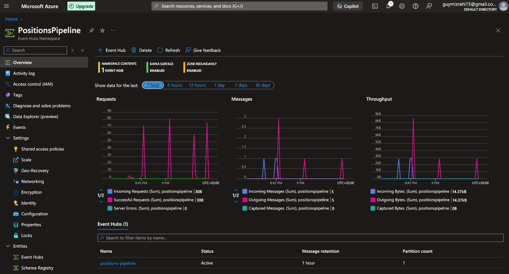
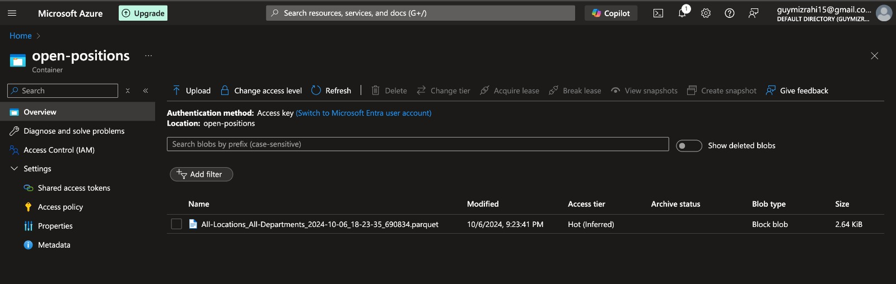

# Position Pipeline 

## Project Overview

This project implements a robust and scalable data pipeline designed to scrape open job positions from a website, process them, and store the results in cloud storage. It leverages a consumer-producer architecture with Kafka as the message broker and Azure Blob Storage for persistent data storage. 

*Key Features:*

* *Web Scraping:*  Scrapes job position data from [https://wsc-sports.com/Careers](https://wsc-sports.com/Careers), ensuring accuracy by verifying filter settings for "All Locations" and "All Departments".
* *Consumer-Producer Pattern:* Utilizes a distributed architecture with a producer and consumer communicating through a Kafka message broker for efficient data handling.
* *Kafka (Azure Event Hubs):* Employs Azure Event Hubs, a fully managed, cloud-native Kafka service, for reliable and scalable message streaming.
* *Parquet File Format:*  Utilizes the Parquet file format, optimized for columnar data storage, to efficiently store and retrieve job position data.
* *Azure Blob Storage:* Leverages Azure Blob Storage, a cost-effective and scalable cloud storage solution, to store the processed job position data.
* *Containerization (Docker):* The producer and consumer components are containerized using Docker for portability, consistency, and ease of deployment.

## Architecture Diagram

```
 [Web Scraper]   -->   [Producer]   -->   [Kafka (Azure Event Hubs)]   -->   [Consumer]   -->   [Azure Blob Storage] 
```

## Requirements

* *Python 3.9+:*  [https://www.python.org/](https://www.python.org/)
* *Docker:*  [https://www.docker.com/](https://www.docker.com/)
* *Azure Account:*  [https://azure.microsoft.com/](https://azure.microsoft.com/) (with an Event Hubs namespace and a Blob Storage account)
* *[Optional] Kubernetes Cluster:* (e.g., AKS, GKE, Minikube)

## Installation and Setup

1. *Clone the Repository:*
   ```bash
   git clone https://github.com/GuyMizrahi1/Position-Pipeline.git
   ```
2. Create a Virtual Environment:

    ```bash
    python3 -m venv venv
    source venv/bin/activate
    ```

3. Azure Setup:
   * Event Hubs: Create an Event Hubs namespace with Kafka enabled in your Azure account.
   * Blob Storage: Create a Blob Storage account and a container within it to store the parquet files.

4. Environment Variables (.env file):
   * Create a .env file in the project's root directory. (As can be seen in the repository structure file)
       ```
       position-pipeline/
       ├── consumer/
       │   ├── tests/
       │   │   ├── test_consumer.py
       │   ├── Dockerfile
       │   ├── main.py
       ├── producer/
       │   ├── tests/
       │   │   ├── test_producer.py
       │   ├── Dockerfile
       │   ├── main.py
       │   ├── scraper.py
       ├── venv/
       ├── .env
       ├── .gitignore
       ├── docker-compose.yaml
       ├── README.md
       └── requirements.txt
       ```
   * Add the following environment variables, replacing placeholders with your actual values:

       ```
       EVENT_HUBS_CONNECTION_STRING=<your_event_hubs_connection_string>
       EVENT_HUB_NAME=<your_event_hub_name>
       AZURE_STORAGE_CONNECTION_STRING=<your_storage_connection_string>
       BLOB_CONTAINER_NAME=<your_blob_container_name> 
       KAFKA_TOPIC=<your_kafka_topic>  # The name of your Event Hub instance
       SSL_CERTIFICATE_PATH='venv/lib/python3.11/site-packages/certifi/cacert.pem'
       ```
   * The docker-compose.yaml gets the environment variables from the .env file.
     and runs first the selenium container for getting the url connection, then the producer container for scraping 
     and finally the consumer container for store the results in cloud storage .


## Running the Pipeline Locally with Docker

1. Build Docker Images:
     ```bash
     docker-compose build
     ```

2. Run the Producer Containers:
   ```bash
   docker-compose up
   ```

3. Turn off the selenium container:
   ```bash
   docker-compose down
   ```
## Testing
Unit tests: \
2 individual test files which located in tests folder in both folders - producer & consumer. \
For running the unit tests:

```bash
PYTHONPATH=./producer python -m unittest discover producer/tests
PYTHONPATH=./consumer python -m unittest discover consumer/tests
```

## Examples of screenshott from the pipeline
### KafkaRequests 
</img>
### Log With Parquet Top 5
</img>
### Container ScreenShot
</img>

